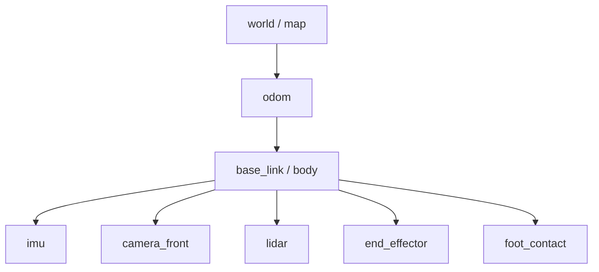
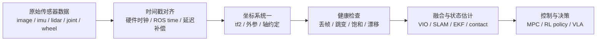
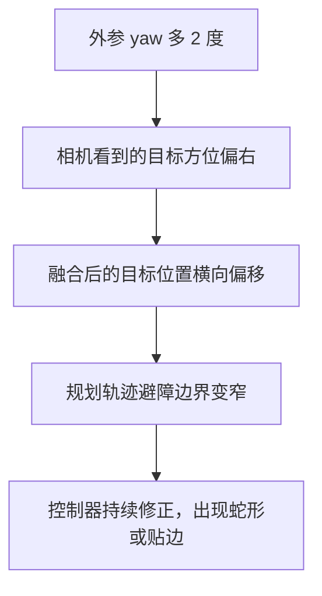
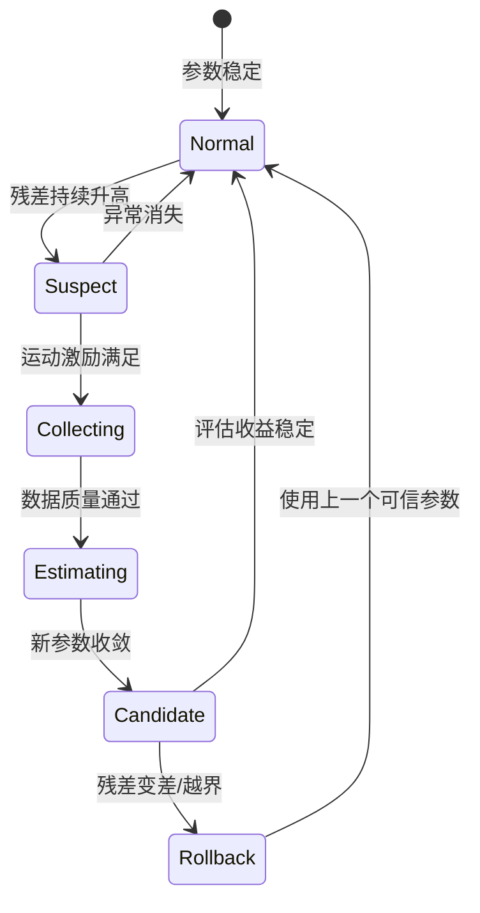
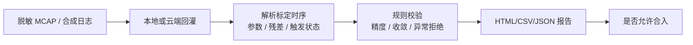
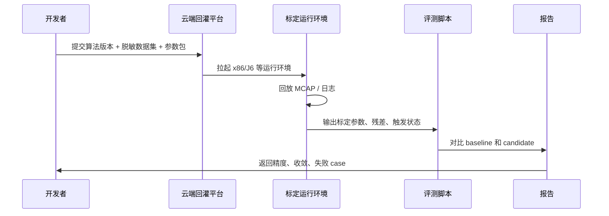
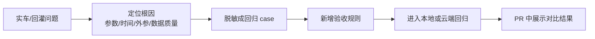

# 传感器标定与 sim2real：坐标系、时间戳与外参误差

强化学习策略、VLA 模型、MPC 控制器和 SLAM 系统都有一个共同前提：输入数据表达的是同一个时刻、同一个物理世界里的状态。如果相机外参错了 2 度，IMU 时间戳慢了 30 ms，轮速方向配置反了，算法看到的世界就会和真实机器人错开。

这就是传感器标定在具身智能里的位置：它不是某个独立工具，而是 sim2real 的地基。

## 从几何标定走向运行时健康监控

离线标定通过后，还要持续检查漂移、温度、振动和时间延迟。建议为每类传感器记录频率、丢包率、时间偏移、静止均值和最近一次标定版本；超过阈值时降级融合或回滚参数，而不是继续把异常数据送入控制回路。

| 指标 | 典型异常 | 优先排查 |
| --- | --- | --- |
| 消息频率/丢包率 | 观测间歇性跳变 | 驱动、网络、CPU 负载 |
| 时间偏移 | 高速运动时重影 | 时间源、缓存、传输延迟 |
| 静止均值 | 姿态缓慢漂移 | IMU 零偏、温度补偿 |
| 融合残差 | 轨迹突然发散 | 外参方向、单位、数据关联 |

这组指标可以在仿真中注入噪声和延迟后复现，形成“故障注入 → 监控告警 → 降级/回滚”的 sim2real 练习闭环。

---

## 1. 先把系统看成一棵坐标树

一个机器人系统里常见的坐标系包括：

- `world` / `map`：任务或地图坐标系。
- `odom`：局部连续里程计坐标系。
- `base_link` / `body`：机器人本体坐标系。
- `camera_*`：相机光心坐标系。
- `imu`：惯性测量单元坐标系。
- `lidar`：激光雷达坐标系。
- `end_effector` / `foot_*`：末端执行器或足端坐标系。



这棵树里每条边都是一个变换：

```text
T_parent_child = [R | t]
```

其中 `R` 是旋转，`t` 是平移。ROS2 的 `tf2` 会把这些边组织起来，自动计算任意两个坐标系之间的变换。

**关键点：标定不是只求一个数，而是定义“哪个坐标系相对于哪个坐标系”的关系。** 工程里最常见的错误不是求解器不够高级，而是方向写反了：你需要的是 `T_base_camera`，代码里却用了 `T_camera_base`。

---

## 2. 数据进入算法前要过三道门

传感器数据通常不是直接进模型，而是经过时间同步、坐标变换和质量检查。



这三道门分别回答：

| 问题 | 典型配置 | 错了会怎样 |
|------|----------|------------|
| 这帧数据是什么时刻的? | 时间戳、时钟源、延迟补偿 | 运动物体拖影，IMU 和图像对不上，控制滞后 |
| 这帧数据属于哪个坐标系? | `frame_id`、tf tree、外参 | 目标位置偏移，点云和图像错位，足端接触点跑偏 |
| 这帧数据可信吗? | 范围、跳变、频率、状态码 | 融合发散，控制抖动，在线标定误触发 |

---

## 3. 外参小误差会被距离放大

假设相机相对于车体或机器人本体有一个 yaw 方向误差 `delta_theta`。一个真实在正前方 `d` 米处的目标，会在横向产生近似误差：

```text
lateral_error ~= d * tan(delta_theta)
```

| 距离 d | yaw 误差 0.5 度 | yaw 误差 1 度 | yaw 误差 2 度 |
|--------|-----------------|---------------|---------------|
| 2 m    | 1.7 cm          | 3.5 cm        | 7.0 cm        |
| 5 m    | 4.4 cm          | 8.7 cm        | 17.5 cm       |
| 10 m   | 8.7 cm          | 17.5 cm       | 34.9 cm       |

这张表说明了一个很实用的判断：近距离抓取任务可能对平移误差更敏感，远距离导航和定位任务会更快暴露角度误差。



这也是为什么真机调试时不能只看“检测框准不准”。检测框准，只代表图像坐标里准；外参错时，投到 `base_link` 或 `map` 后仍然会错。

---

## 4. 时间同步错误等价于空间误差

如果机器人以速度 `v` 运动，传感器时间戳有延迟 `delta_t`，那么最基本的位置误差近似是：

```text
position_error ~= v * delta_t
```

| 速度 v | 延迟 10 ms | 延迟 30 ms | 延迟 100 ms |
|--------|------------|------------|-------------|
| 0.5 m/s | 0.5 cm | 1.5 cm | 5 cm |
| 1.0 m/s | 1 cm | 3 cm | 10 cm |
| 3.0 m/s | 3 cm | 9 cm | 30 cm |

对机械臂末端相机来说，`v` 可以是末端速度；对四足机器人来说，`v` 可以是机身速度；对轮足或移动机器人来说，`v` 可以是底盘速度。只要系统在动，时间误差就会变成空间误差。

工程上可以用三个信号快速定位时间问题：

| 信号 | 看什么 |
|------|--------|
| 频率 | 相机、IMU、轮速、关节状态是否稳定发布 |
| 单调性 | 时间戳是否回退、重复、跳变 |
| 相位差 | 加速度、角速度、轮速变化是否明显错位 |

---

## 5. 标定对象不只有相机

具身机器人常见标定对象可以按“测量什么”分组。

| 对象 | 标定内容 | 常见观测指标 |
|------|----------|--------------|
| 相机内参 | 焦距、主点、畸变 | 重投影误差、边缘直线弯曲 |
| 相机外参 | `camera` 到 `base/imu/lidar` | 图像-点云错位、目标落点偏移 |
| IMU | bias、scale、噪声、安装方向 | 静止漂移、重力方向、 Allan variance |
| 轮速 | 比例系数、左右轮差、方向 | 直线跑偏、转弯半径不一致 |
| 关节 | 零位、方向、传动比、限位 | FK 末端误差、左右腿不对称 |
| 足端/触觉 | 接触阈值、安装位置、延迟 | 支撑相误判、落足点跳变 |

这些量会互相影响。例如 IMU 安装方向错，会让姿态估计错；姿态估计错，会让相机点投到地面时错；地面目标位置错，规划和控制就会跟着错。

---

## 6. 具身机器人标定和车端标定有什么不一样

车端标定经验很有用，但不能原封不动搬到具身机器人。共同点是坐标系、时间戳、外参、残差和回归验收；差异主要来自机器人身体形态和任务闭环。

| 维度 | 车端常见情况 | 具身机器人常见情况 |
|------|--------------|--------------------|
| 运动模型 | 平面运动为主，车体刚性较强 | 机械臂、轮式、四足、人形都有不同运动学 |
| 坐标树 | 传感器多固定在车体上 | 传感器可能装在末端、头部、躯干或关节链上 |
| 标定对象 | camera-body、camera-lidar、IMU、轮速 | hand-eye、关节零位、足端接触、触觉、末端相机 |
| 误差表现 | 车道线、目标、点云、轨迹横向误差 | 抓取偏差、落足偏差、末端位姿误差、接触误判 |
| 激励条件 | 转弯、加减速、不同距离目标 | 关节运动、末端姿态变化、支撑相切换、接触事件 |
| 在线风险 | 误更新会影响定位和规划 | 误更新可能直接影响抓取、碰撞、平衡和接触控制 |

因此，具身智能里的标定要多问一个问题：**这个参数误差最后会让机器人任务失败在哪里？**

例如：

- 机械臂末端相机 yaw 错：目标在图像里看起来对，但抓取点投到 `base_link` 后偏了几厘米。
- 四足机身相机外参错：目标方向估计偏，策略一直朝错误方向修正，步态看起来像在“追偏”。
- 触觉或足端接触阈值错：状态估计以为已经接触地面，实际还在空中，控制器会提前切换支撑相。
- 关节零位错：仿真里的腿长和真实 FK 不一致，sim2real 后落足点系统性偏移。

---

## 7. 在线标定要有触发和回退

离线标定解决“出厂或装配后参数是什么”，在线标定解决“运行中参数有没有变”。在线标定不能只看优化是否收敛，还要看它是不是在正确场景下被触发。



一个可落地的在线标定监控至少要记录：

- 触发原因：残差升高、温度变化、碰撞/震动、维修换件、长时间运行漂移。
- 数据质量：运动激励是否足够，传感器频率是否稳定，是否有时间戳异常。
- 参数变化：roll / pitch / yaw / x / y / z 相对上一次可信参数变化多少。
- 收敛状态：优化是否收敛，收敛时间是否异常。
- 回退条件：新参数是否让重投影、点云对齐、轨迹误差或控制稳定性变差。

---

## 8. 调试清单：先查低级错误

真实项目里，很多“算法效果不好”最后会落到很基础的问题。

| 优先级 | 检查项 | 快速判断 |
|--------|--------|----------|
| 1 | `frame_id` 是否正确 | RViz/tf tree 是否能连通，父子方向是否符合约定 |
| 2 | 单位是否一致 | 角度是 rad 还是 deg，长度是 m 还是 mm |
| 3 | 轴方向是否一致 | x 前 y 左 z 上，还是相机光学坐标系 |
| 4 | 时间戳是否可信 | 是否回退、重复、跳变，延迟是否补偿 |
| 5 | 静态/动态变换归属 | 固定外参不要被多个节点重复发布 |
| 6 | 参数是否匹配车型/机器人 | 相机编号、IMU 位置、轮距、关节零位是否串配置 |
| 7 | 数据是否覆盖标定所需激励 | 只直行很难估 yaw，静止数据不能估尺度 |

实践中建议把每次问题定位写成四列：

```text
现象 -> 观测信号 -> 根因假设 -> 验证动作
```

例如：

```text
点云投影到图像整体偏右
-> 近处偏差小，远处偏差大
-> camera-lidar yaw 外参偏差
-> 人工调 yaw +/- 1 度观察投影残差曲线
```

---

## 9. 在线标定小游戏：把外参误差变成机器人任务误差

完全小白最容易被“公式”和“坐标系”劝退，所以可以先玩一个很小的在线标定游戏。它不只估计 yaw，还会把残差映射成机器人任务误差。

网页端入口：

```text
/perception/sensor-calibration-playground
```

如果本地服务运行在 `http://localhost:3000/dive-into-embodied-ai/`，完整地址是：

```text
http://localhost:3000/dive-into-embodied-ai/perception/sensor-calibration-playground
```

1. 程序藏了一个真实相机 yaw 外参误差，例如 `1.8 deg`。
2. 机器人每一帧看到一个前方目标，目标越远，yaw 误差造成的横向残差越大。
3. 在线标定器不能直接看到真实误差，只能根据残差一点点更新估计值。
4. 残差会被换算成任务误差：机械臂抓取偏差、移动机器人到点偏差或四足目标跟踪偏差。
5. 如果残差下降、估计值收敛，并且任务误差小于阈值，就算通关。

运行：

```bash
python3 codes/foundations/perception/sensor-calibration/online_calib_game.py \
  --level normal \
  --embodiment arm \
  --initial-guess-deg 0.0 \
  --update-gain 0.35 \
  --csv /tmp/online_calib_game.csv
```

输出类似：

```text
Online calibration game: estimate the hidden camera yaw offset
level=normal seed=7 true_yaw=1.80 deg
robot_task=eye-in-hand grasp metric=grasp_miss_m threshold=0.035 m

 frame  dist  residual       estimate  abs_err  task_err  event
     0  1.50m                                   |                                      0.000   1.800    2.31cm  watch
     3  4.25m                                   |>>                                    0.700   1.100    5.57cm  UPDATE
     6  6.50m                                   |>                                     1.525   0.275    4.52cm  UPDATE
     9  2.00m                                   |                                      1.751   0.049    0.37cm  watch

Regression checks
- final estimate: 1.751 deg
- final abs error: 0.049 deg
- residual improvement: 65.7%
- convergence frame: 10
- final task error: 0.85 cm
- final task success rate: 100.0%
- result: PASS
```

可以切换不同机器人任务：

```bash
# 机械臂：末端相机抓取，任务指标是 grasp_miss_m
python3 codes/foundations/perception/sensor-calibration/online_calib_game.py --embodiment arm

# 移动机器人：朝目标点移动，任务指标是 nav_lateral_error_m
python3 codes/foundations/perception/sensor-calibration/online_calib_game.py --embodiment mobile

# 四足机器人：机身相机目标跟踪/落足参考，任务指标是 tracking_or_foothold_error_m
python3 codes/foundations/perception/sensor-calibration/online_calib_game.py --embodiment quadruped
```

这段小游戏背后对应真实工程里的几个概念：

| 游戏变量 | 工程对应物 |
|----------|------------|
| `true_yaw` | 真实外参误差，真机上通常不可直接知道 |
| `lateral_residual` | 重投影误差、点云投影误差、轨迹横向误差等残差 |
| `robot_task_error_m` | 抓取偏差、导航横向误差、目标跟踪或落足误差 |
| `triggered` | 在线标定触发条件，例如残差持续升高且运动激励足够 |
| `estimate` | 在线估计出的新外参 |
| `accepted` | 参数验收，只有残差、参数变化和任务误差都可信才写回 |

代码不依赖任何私有数据，也不需要 ROS、MCAP 或云平台；它的价值是让初学者先看到“在线标定不是玄学，而是一条残差下降曲线，更是一条任务误差下降曲线”。

---

## 10. 工程化迭代验收：四级门禁

真实项目里，标定算法不是“我看了一段日志觉得不错”就能合入。每次修改都应该从便宜到昂贵经过四级门禁：

| 门禁 | 跑什么 | 目的 | 失败时怎么处理 |
|------|--------|------|----------------|
| Level 0 本地小实验 | `online_calib_game.py` 这种合成数据 | 先证明更新逻辑没有明显写反、震荡或不收敛 | 修公式、符号、阈值，不进入真实数据 |
| Level 1 离线回归 | 脱敏 CSV/JSON/MCAP 小集合 | 比较精度、收敛帧数、误触发次数 | 定位具体 case，补规则或修算法 |
| Level 2 本地回灌 | x86/J6/仿真环境回放固定数据 | 验证运行时依赖、参数加载、topic 和日志产出 | 修环境、配置、参数包和解析脚本 |
| Level 3 云端回灌 | 云平台批量跑数据集 | 验证规模化稳定性和版本对比 | 输出报告，阻塞合入或灰度 |

这四级门禁的核心思想是：**越靠前越便宜，越靠后越接近真实系统。** 不要把符号写反、参数包加载错误这种问题留到云端批量任务里才发现。

小游戏可以直接作为 Level 0 smoke test：

```bash
python3 codes/foundations/perception/sensor-calibration/online_calib_game.py \
  --level normal \
  --embodiment arm \
  --fail-on-regression
```

如果回归条件不满足，脚本会返回非零退出码，CI 可以直接拦住这次修改。

---

## 11. 从小游戏升级成真实回归

1. 精度有没有变好？
2. 收敛有没有变慢？
3. 有没有在异常数据上误触发？

因此一个最小回归集可以按数据类型分层：

| 数据类型 | 目的 | 验收指标 |
|----------|------|----------|
| 正常收敛 case | 验证算法能收敛 | 最终误差、收敛帧数、残差下降比例 |
| 弱激励 case | 验证不会乱更新 | 触发次数、参数变化上限 |
| 时间戳异常 case | 验证健康检查 | 是否拒绝回退/重复/跳变时间戳 |
| 传感器跳变 case | 验证鲁棒性 | spike 是否被过滤，是否误写参数 |
| 机器人任务 case | 验证是否真的帮助任务 | 抓取成功率、到点误差、落足误差、接触误判率 |
| 基线对比 case | 验证版本迭代 | 新旧版本参数差、耗时差、任务成功率差 |

在线标定回归不应该只看“最终是否成功”，还要保留过程曲线。推荐每次输出一份结构化结果，作为后续报告和 PR 讨论的依据：

```json
{
  "case_name": "camera_yaw_normal_converge",
  "input_bag": "desensitized_case_001.mcap",
  "baseline_version": "v1",
  "candidate_version": "v2",
  "final_abs_error_deg": 0.12,
  "robot_task_error_m": 0.008,
  "task_success_rate": 0.98,
  "convergence_frame": 9,
  "residual_improvement": 0.66,
  "trigger_count": 12,
  "accepted": true
}
```

这和上面的小游戏是一回事，只是真实系统把 `lateral_residual` 换成了真实日志中的重投影、点云对齐、轨迹或接触残差。



---

## 12. 云平台回灌：把一次调试变成可重复实验

当数据变多以后，本地手动跑脚本会很快失控。工业项目通常会把回放和评测放到云平台上：输入一批脱敏数据和一个算法版本，平台自动拉起环境、回放数据、收集结果、生成报告。这类流程可以理解成“标定算法的 CI”。

公开教程里可以把内部平台统一抽象成 **cloud fillback**，不暴露真实平台名、任务号、车辆号、bucket 路径和客户数据。你可以把 AIDI 这类平台理解成一个工程化执行器：它不改变标定原理，只是把“拉参数、跑回灌、收结果、做对比”自动化。



一个脱敏后的云端回灌任务至少要检查：

| 阶段 | 检查项 |
|------|--------|
| 输入准备 | 数据集 ID、算法版本、参数包版本、传感器配置是否匹配 |
| 参数加载 | 平台实际使用的是哪一份参数包，是否被旧数据集参数覆盖 |
| 回灌执行 | 回放是否完整，关键 topic 是否存在，运行环境是否一致 |
| 结果产出 | 是否生成标定结果、残差曲线、触发状态和错误码 |
| 任务评估 | 抓取、导航、落足、接触等任务指标是否变好 |
| 对比评估 | candidate 相对 baseline 的精度、收敛时间、失败率和任务成功率是否变差 |
| 归档复现 | 输入、输出、日志、报告是否能按任务 ID 重新定位 |

注意这里的“参数包实际使用了哪一份”非常重要。很多回归结论不可信，并不是算法变了，而是云端回灌时加载了错误车型、错误数据集或旧版本参数。

一个工程化验收报告可以长这样：

| 维度 | baseline | candidate | 结论 |
|------|----------|-----------|------|
| 通过 case 数 | 48 / 50 | 49 / 50 | 变好 |
| 平均收敛帧 | 118 | 96 | 变好 |
| 最大 yaw 变化 | 1.2 deg | 1.1 deg | 持平 |
| 弱激励误触发 | 2 | 0 | 变好 |
| 时间戳异常拒绝率 | 100% | 100% | 持平 |
| 机器人任务成功率 | 92% | 97% | 变好 |
| 平均运行耗时 | 1.00x | 1.08x | 可接受 |

PR 里不要只贴“已验证通过”，而要贴这类对比表。评审者才能判断这次修改是局部修 case，还是整体更稳。

---

## 13. 迭代闭环：从一次问题到一条规则

工程化验收还有一个很重要的习惯：每发现一个线上或实车问题，都要尽量沉淀成可重复 case。



例如：

| 现场现象 | 根因 | 新增回归规则 |
|----------|------|--------------|
| 某段数据外参突然跳变 | 时间戳回退导致残差异常 | 时间戳非单调时禁止更新参数 |
| 弱纹理路段误触发在线标定 | 运动激励不足 | 低激励 case 的参数变化必须小于阈值 |
| 新版本收敛更快但偶发越界 | 更新步长过大 | 参数单帧变化量和总变化量都要设上限 |
| 云端结果和本地不一致 | 参数包加载路径不同 | 报告必须记录实际使用的参数包摘要 |

这样做的价值是：同一个问题不会靠人肉经验反复排查，而是变成一条自动验收规则。

---

## 14. 脱敏原则：能讲方法，不泄露现场

把真实项目经验写进公开教程时，可以保留工程结构，但要脱敏数据和路径：

| 可以保留 | 不应公开 |
|----------|----------|
| 回灌链路：数据 -> 回放 -> 解析 -> 规则 -> 报告 | 内部 bucket、机器名、账号、token |
| 指标定义：残差、收敛帧、参数变化、失败率 | 真实车号、设备编号、客户项目名 |
| 合成或匿名化曲线 | 原始图像、点云、车牌、人脸、路线 |
| 通用 MCAP topic 设计思想 | 内部 topic 全量列表和私有消息字段 |
| baseline/candidate 对比方法 | 未发布算法分支、内部版本包路径 |

一个好的公开案例应该让读者学会方法，而不是依赖你的内部平台。最合适的写法是：

```text
真实系统里我们会用云平台批量回灌 MCAP；
公开教程里先用 online_calib_game.py 模拟同样的闭环；
等读者理解后，再把输入替换成自己的 rosbag / mcap / csv。
```

---

## 15. 一个最小练习

不用真机也可以做一个标定敏感性实验：

1. 运行 `online_calib_game.py --level easy --embodiment arm`，观察估计值和抓取误差如何收敛。
2. 把 `--update-gain` 改成 `0.05`，观察收敛变慢。
3. 把 `--update-gain` 改成 `0.9`，观察是否更容易震荡。
4. 把 `--embodiment` 改成 `mobile` 和 `quadruped`，比较不同机器人任务的验收阈值。
5. 把难度改成 `--level hard`，观察噪声变大后是否还能通过回归检查。
6. 打开 CSV，画出 `estimate_deg`、`mean_abs_residual_m` 和 `robot_task_error_m` 三条曲线。

最小绘图代码：

```python
import csv

with open("/tmp/online_calib_game.csv", newline="") as f:
    rows = list(csv.DictReader(f))

for r in rows[::5]:
    frame = int(r["frame"])
    estimate = float(r["estimate_deg"])
    residual_cm = float(r["mean_abs_residual_m"]) * 100
    task_cm = float(r["robot_task_error_m"]) * 100
    print(f"{frame:03d} estimate={estimate:5.2f} deg residual={residual_cm:5.2f} cm task={task_cm:5.2f} cm")
```

如果你把这个练习接到真实日志上，横向误差就可以替换成重投影误差、点云配准误差、轨迹横向误差或落足点误差。教程后续可以继续把它扩展成完整的 IMU、轮速、关节和足端接触标定实验。
