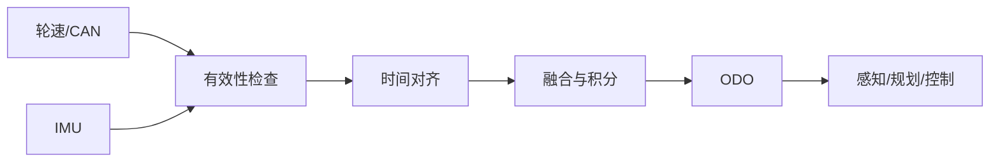

# ODO、时间戳与状态估计

速度、角速度和位姿估计是感知与控制之间的桥。先检查输入是否有效，再谈融合结果：无效的 CAN 值、零时间戳或错误坐标系会让后续算法看起来像“漂移”。

逐帧评估时使用消息 `header.stamp`，记录输入有效性、估计位姿和参考轨迹。报告平均误差、P95、最大误差和失败片段，并区分内部闭环一致性与绝对精度。

## 调试顺序

1. 检查 topic 是否持续发布、频率是否稳定。
2. 检查速度、yaw rate、gear 等字段的 validity 和单位。
3. 检查时间戳是否单调、是否存在固定延迟。
4. 检查 `map/odom/base_link` 的变换方向。
5. 最后再分析积分漂移和融合参数。

练习：生成一段带 30 ms 延迟和 1% 轮速比例误差的轨迹，比较校正前后的横向漂移。
